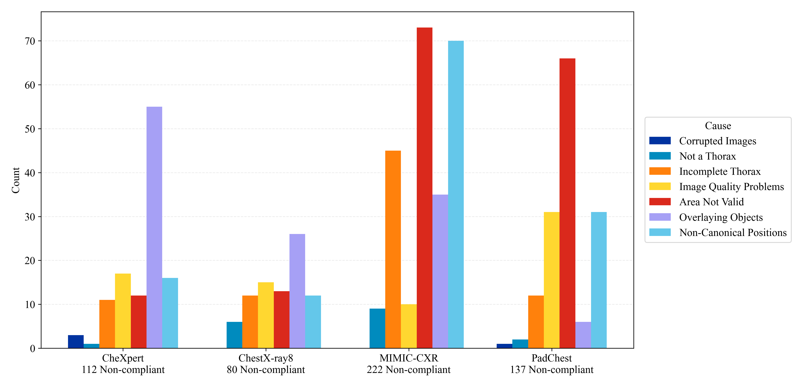

# CSV Statistics

# Database Statistics

# Dataset: CheXpert
Total non-compliant images: 112

## Causes for non-compliant images
- Corrupted Images: 3 (2.68%)
- Not a Thorax: 1 (0.89%)
- Incomplete Thorax: 11 (9.82%)
- Image Quality Problems: 17 (15.18%)
- Area Not Valid: 12 (10.71%)
- Overlaying Objects: 55 (49.11%)
- Non-Canonical Positions: 16 (14.29%)
- No cause: 0 (0.00%)

# Dataset: ChestX-ray8
Total non-compliant images: 80

## Causes for non-compliant images
- Corrupted Images: 0 (0.00%)
- Not a Thorax: 6 (7.50%)
- Incomplete Thorax: 12 (15.00%)
- Image Quality Problems: 15 (18.75%)
- Area Not Valid: 13 (16.25%)
- Overlaying Objects: 26 (32.50%)
- Non-Canonical Positions: 12 (15.00%)
- No cause: 0 (0.00%)

# Dataset: MIMIC-CXR
Total non-compliant images: 222

## Causes for non-compliant images
- Corrupted Images: 0 (0.00%)
- Not a Thorax: 9 (4.05%)
- Incomplete Thorax: 45 (20.27%)
- Image Quality Problems: 10 (4.50%)
- Area Not Valid: 73 (32.88%)
- Overlaying Objects: 35 (15.77%)
- Non-Canonical Positions: 70 (31.53%)
- No cause: 0 (0.00%)

# Dataset: PadChest
Total non-compliant images: 137

## Causes for non-compliant images
- Corrupted Images: 1 (0.73%)
- Not a Thorax: 2 (1.46%)
- Incomplete Thorax: 12 (8.76%)
- Image Quality Problems: 31 (22.63%)
- Area Not Valid: 66 (48.18%)
- Overlaying Objects: 6 (4.38%)
- Non-Canonical Positions: 31 (22.63%)
- No cause: 0 (0.00%)

